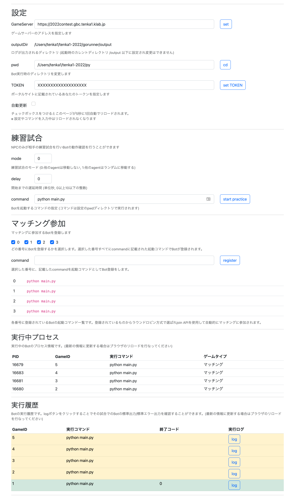

Runnerの使い方
======

## Runnerの概要
- Runnerはゲームへの参加とbotの起動を支援するプログラムです。
- Runnerにbotを登録すると、自動的に `join` APIを使用してマッチングに参加しゲーム開始時にbotを起動します。
- Runnerが実行したbotの標準出力はゲームごとにファイルに保存されます。

## Runnerの起動方法

### ビルド済バイナリを起動する
[リポジトリ内のgorunnerディレクトリ](/gorunner) にある gorunner バイナリを実行します。

### ビルドして実行する
[リポジトリ内のgorunnerディレクトリ](/gorunner) にある main.go がソースコードです。 `go run main.go` でビルドして実行することができます。

プログラム起動時に自動的にブラウザが立ち上がり次のような画面が表示されます。

## 設定
- GameServer: ゲームサーバーのアドレスを指定します。
- outputDir: Runner起動時のカレントディレクトリ/output 以下に出力されます。この設定は変更できません。
- pwd: カレントディレクトリを変更します。
- TOKEN: ポータルサイトに記載されているあなたのトークンを指定します。
- 自動更新: チェックボックスをオンにすると5秒ごとに自動でページのリロードがされます。

これらの設定は runner 起動時のカレントディレクトリの `config.toml` に保存されます。

## 練習試合
NPCのみが相手の練習試合を行いbotの動作確認を行うことができます。

- mode: 練習試合のモードを選択します。
- delay: 練習試合開始までの遅延時間を指定します。
- command: botを起動するコマンドを指定します。コマンドは設定のpwdディレクトリで実行されます。
    - Runnerから起動されたBotは速やかにmoveを行う必要があります。
    - ビルドと実行を同時に行う `go run` や `dotnet run` などのコマンドを指定すると、最初の数ターン行動できない場合があることに注意してください。

`[start practice]` ボタンをクリックすると、指定したbotで練習試合を開始します。

## マッチング参加
マッチングに参加するBotを登録します。

最大4つのbotを登録することができます。使用されるbotはラウンドロビン方式で選ばれます。

1. チェックボックスでどの番号にbotを登録するかを選択します。
2. command にbotの起動コマンドを入力します。これは練習試合と同じものです。
    - Runnerから起動されたBotは速やかにmoveを行う必要があります。
    - ビルドと実行を同時に行う `go run` や `dotnet run` などのコマンドを指定すると、最初の数ターン行動できない場合があることに注意してください。
3. `[register]` ボタンをクリックして指定botを登録します。

botが一つでも登録されている場合、Runnerは `join` APIを使用してマッチングに参加します。

botの登録を解除したい場合は、command を空文字にして `[register]` をクリックします。

## Botに渡される環境変数
これらの値はBotプログラムから利用することができます。

- `GAME_SERVER`: GameServer で指定されている値が設定されます。
- `TOKEN`: TOKEN で指定されている値が設定されます。
- `GAME_ID`: 参加したゲームのゲームIDが設定されます。

## 実行中プロセス
練習試合、マッチングによる試合ともに、botが実行されると実行中のbotの情報が表示されます。

実行中のbotの情報を更新する場合はブラウザのリロードを行なってください。

## 実行履歴
練習試合、マッチングによる試合ともに、botが実行されるとbotの標準出力/標準エラー出力がファイルに記録されます。

Botの実行が終了すると終了コードも表示されるので正常に終了していたかやエラーが出ていたかの参考にしてください。

また、背景の色は実行中は黄色、終了コードが0は緑、それ以外は赤で表示されます。

`[log]` ボタンをクリックすることで、botのログを閲覧することができます。ログファイル自体は、outputDir以下に保存されています。

実行履歴が更新されない場合はブラウザのリロードを行ってください。
