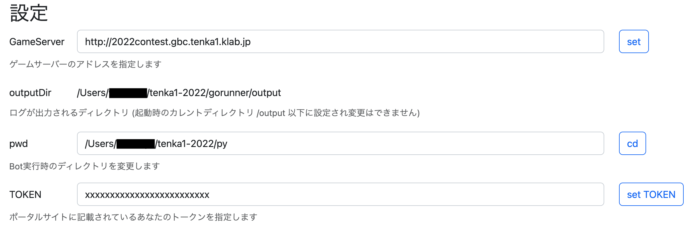
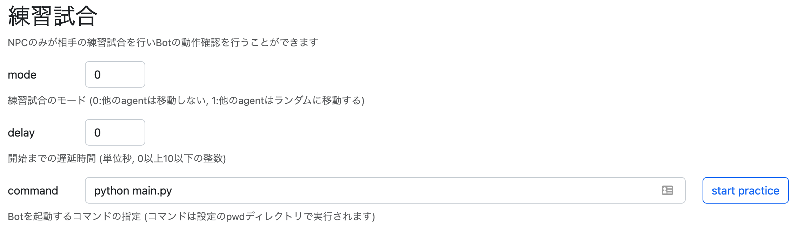
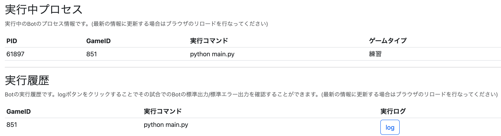
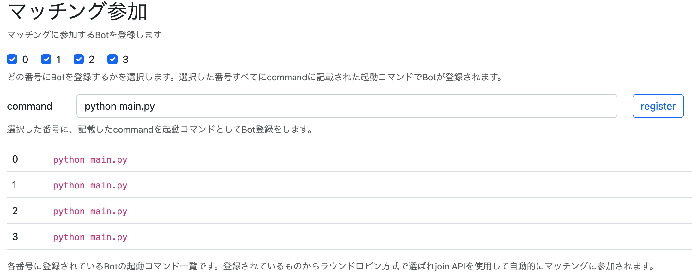
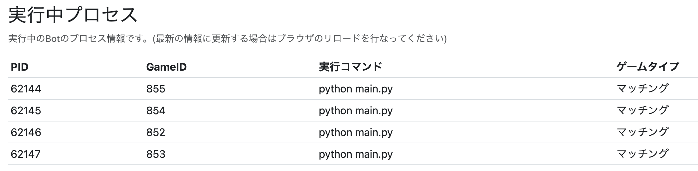
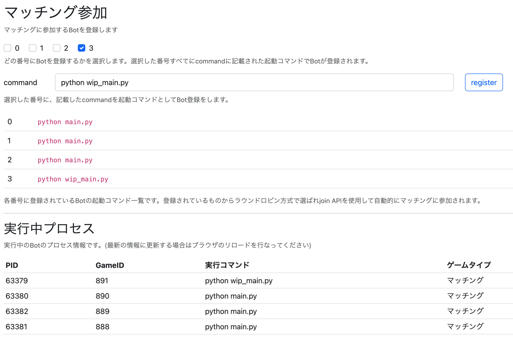

チュートリアル
====

このドキュメントでは、コンテスト参加者がサンプルのBotを動かし、マッチングに参加するまでの手順を説明します。

プログラムを改修しながらマッチングに参加する手順も記載してありますが、必ずしもこちらの手順に従う必要はありません。

まずは [問題概要](https://github.jp.klab.com/tenka1/gbc2022/blob/master/problem.md#%E5%95%8F%E9%A1%8C%E6%A6%82%E8%A6%81) に目を通し、ゲームの概要を把握してから始めてください。

## 1. TOKENを取得する

[ポータルサイト](https://2022contest.gbc.tenka1.klab.jp/portal/index.html) にユーザー登録してログインし、画面中央に表示されているトークンをメモしておきます。

> 詳しくは[ポータルサイトの使い方](portal.md)を参照してください

## 2. サンプルbotをダウンロードする
以下のいずれかから、自分が使用したいプログラミング言語のサンプルをダウンロードしてください。
手元のPCにビルド環境・実行環境が整っている必要があります。

- [Go](go)
- [Python](py)
- [C#](cs)
- [Rust](rust)
- [C++(libcurl)](cpp) 通信にライブラリを使用
- [C++(Python)](cpp_and_python) 通信にPythonを使用

このチュートリアルでは Python を使用して説明します。

## 3. サンプルbotを動かす

ダウンロードしたサンプルプログラムを編集して、`YOUR_TOKEN` という文字列をメモしておいた自分のトークンで置き換えます。

編集したプログラムを実行すると、自分以外がNPCである練習試合が始まります。

Pythonの例:
```
$ python main.py
https://2022contest.gbc.tenka1.klab.jp/api/start/xxxxxxxxxxxxxxxxxxxxxxxxx/0/0
https://2022contest.gbc.tenka1.klab.jp/api/move/xxxxxxxxxxxxxxxxxxxxxxxxx/1/0
status = ok
turn = 1
score = 0 0 0 0 0 0
https://2022contest.gbc.tenka1.klab.jp/api/move/xxxxxxxxxxxxxxxxxxxxxxxxx/1/3
status = ok
turn = 2
score = 0 0 0 0 0 0
https://2022contest.gbc.tenka1.klab.jp/api/move/xxxxxxxxxxxxxxxxxxxxxxxxx/1/1
status = ok
turn = 3
score = 0 0 0 0 0 0
https://2022contest.gbc.tenka1.klab.jp/api/move/xxxxxxxxxxxxxxxxxxxxxxxxx/1/1
status = ok
turn = 4
score = 0 0 0 0 0 0
https://2022contest.gbc.tenka1.klab.jp/api/move/xxxxxxxxxxxxxxxxxxxxxxxxx/1/3
status = ok
turn = 5
score = 0 0 0 0 0 0
https://2022contest.gbc.tenka1.klab.jp/api/move/xxxxxxxxxxxxxxxxxxxxxxxxx/1/3
status = ok
turn = 6
score = 0 0 0 0 0 0
https://2022contest.gbc.tenka1.klab.jp/api/move/xxxxxxxxxxxxxxxxxxxxxxxxx/1/1
status = ok
turn = 7
score = 0 0 0 0 0 0
https://2022contest.gbc.tenka1.klab.jp/api/move/xxxxxxxxxxxxxxxxxxxxxxxxx/1/0
...
```

botが動作しているようなら、次の手順に進みましょう。

## 4. ビジュアライザで動作を確認する

[ポータルサイト](https://2022contest.gbc.tenka1.klab.jp/portal/index.html) に戻り、トップページ下部にある `[ビジュアライザを開く]` ボタンをクリックすると、ビジュアライザが起動します。

ビジュアライザの画面右側に参加したゲームの一覧があるので、ゲームを選択してbotの動作を見ることができます。

> 詳しくは[ビジュアライザの使い方](visualizer.md)を参照してください

今回は `P` のマークがついている練習試合を観戦します。

> サンプルbot実装は、1ターン先読みして塗った面積が多くなる移動方向を列挙し、その中からランダムで1つを決定するものになっています。

## 5. Runnerのダウンロードと起動
Runnerはマッチへの参加とbotの起動を支援してくれるプログラムです。使用は必須ではありませんが使用することをおすすめします。

リポジトリの [gorunner](gorunner) ディレクトリ以下に、ビルド済の Runner が配置されています。

自身の環境に合わせて適切なバイナリをダウンロードしてください。
- Windows: [gorunner/gorunner-win-x64.exe](gorunner/gorunner-win-x64.exe)
- macOS: [gorunner/gorunner-darwin-x64](gorunner/gorunner-darwin-x64)
- Linux: [gorunner/gorunner-linux-x64](gorunner/gorunner-linux-x64)

> Runnerのソースコードも同じディレクトリに配置されているので、改変して使用したり、上記以外の環境のためにビルドして使用することができます。

ダウンロードしたRunnerを起動すると、ブラウザが自動で起動しRunnerの設定画面が表示されます。

## 6. Runnerの設定
以下の手順でRunnerの共通設定を行ってください。

1. GameServer で https://2022contest.gbc.tenka1.klab.jp を指定し `[set]` をクリックする (14:51追記)
1. プログラムがあるディレクトリにpwdを設定する
    - Pythonの場合は `[リポジトリへのパス]/py` を設定する
1. TOKENを自分のものに変更し、`[set TOKEN]` をクリックする

> 

## 7. 練習試合を実行する
以下の手順でRunnerを使用して練習試合を開始します。

1. 練習試合の欄で command にBotの実行コマンドを設定して `[start practice]` ボタンをクリックする
    - 例えばPythonのサンプルを実行する場合は `python main.py` になります

> 

2. この時点でプログラムが実行開始されます
1. ブラウザの更新をすると実行中プロセスの欄に先ほど実行した情報が表示されます
1. また実行履歴の欄にも同じGameIDのものが表示されています
1. 実行履歴の欄で `[log]` のボタンをクリックすると実行したプログラムの標準出力/エラー出力のログが表示されます

> 

ここでうまく動作しない場合、Runner上部にエラーメッセージが表示されていないか確認してください。

## 8. マッチングに参加する
練習試合で実行コマンドが動作することを確認したら、マッチングに参加しましょう。

Runnerには最大4つのBot実行コマンドを登録することができます。
予選リーグでは同時に最大4つの試合に参加しますが、
- Botを1つだけ登録した場合はその1つが4つ実行されます
- Botを4つ登録しておくとそれぞれのコマンドが1つずつ実行されます
> Botの選ばれ方の詳細は[Runnerのドキュメントのマッチング参加](runner.md#マッチング参加)に記載されています

以下の手順でRunnerにbotを登録してマッチングに参加します。

1. マッチング参加の下にある 0~3 全てにチェックを入れた状態にする
2. command にマッチングに参加する際のBot実行コマンドを入力する
    > 実行履歴の欄に過去実行したコマンドや練習試合で使用したコマンドが表示されているので、コピーして使用することができます。
3. `[register]` ボタンをクリックしてBotを登録する
    - 1で選択した番号にBotが登録されます
> 

4. マッチが開始されるのを待つ
    - Botが登録されると Runnerは[マッチング参加API](problem.md#マッチング参加api)を毎秒呼び出し、新しい試合を見つけると登録していたコマンドでBotを起動します
    > この時に設定欄の自動更新オプションをオンにしておくと自動でページがリロードされ、実行中プロセスに表示されるので試合が行われているかを確認することができます

    > またビジュアライザ上でも試合が行われているかを確認することができます

> 

図では4つの試合に参加したので、Botが4つ起動されています。

※ Runnerから起動されたBotは速やかにmoveを行う必要があります。ビルドと実行を同時に行う `go run` や `dotnet run` などのコマンドを指定すると、最初の数ターン行動できない場合があることに注意してください。

## 9: プログラムを改修しながらマッチングに参加する

マッチング参加までのチュートリアルは以上です。練習試合を使ってBotを改良し、動作が良好そうなBotをマッチングに参加させましょう。

Botは最大4つ登録できるので、そのうち1つだけを新しいバージョンに差し替えて様子をみるといった事ができます。

最後にその手順の例を説明します。

1. 改修中のプログラムと実行中のファイルやバイナリを分ける
    - 例えばPythonのサンプルを改修する場合は`cp main.py wip_main.py`で改修用のプログラムを分けておきます
1. 「練習試合を実行する」の手順で改修用のプログラムを指定する
    - Pythonの例: `python wip_main.py`を command に設定します
1. 練習試合を通してプログラムを改修します
1. 「マッチングに参加する」の手順で Botの番号を1つだけ選択し、改修版を実行するコマンドを登録する
    - 番号3だけにチェックを入れる
    - Pythonの例: `python wip_main.py`を command に設定して `[register]` をクリックする
1. マッチが開始されるのを待つ

> 

4. 試合を眺めて問題なさそうだったら全ての番号に改修後のプログラムを登録する
    - もし改修に不具合がありスコアが悪化してしまうなら番号3を修正前のプログラムに戻す
